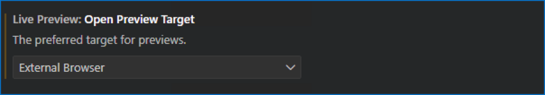
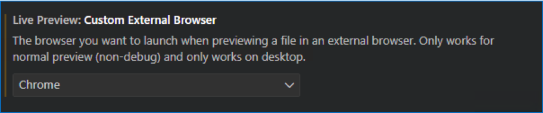
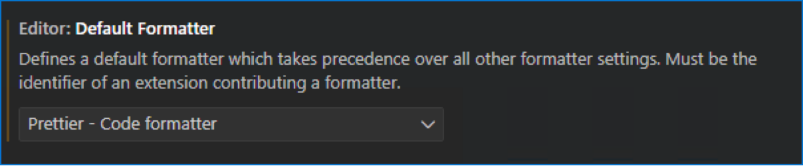
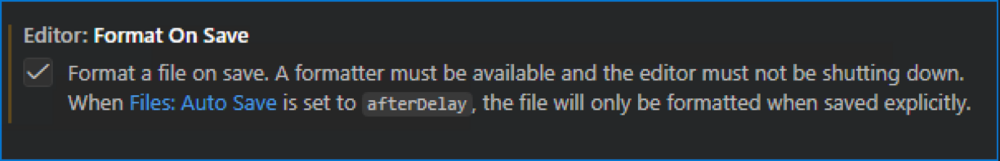

# Software Web Engineering 1

This document describes the software required for **Web Engineering 1**. It assumes that you are working with **Windows**. Other operating systems should work as well, but steps might be slightly different.

## Google Chrome

Install Google Chrome from https://www.google.com/chrome/. In principle, any other **Web Browser** should do as well.

## Visual Studio Code

Install Visual Studio Code from https://code.visualstudio.com/download. In principle, any other **Integrated Development Environment (IDE)** should do as well.

Within Visual Studio Code, install the following extensions. You can do this via the **Extension** panel on the left or via the menu **View -> Extensions**.

- **Live Preview**: hosts a local web server to easily preview web pages (HTML documents)
- **Prettier - Code formatter**: is a code formatter that helps to ensure that code is consistently formatted and readable

Subsequently you need to configure both extensions:

- **Live Preview**: Ensure that the preview target is an external browser and that it defaults to Google Chrome.
  
  

- **Prettier - Code formatter**: Make Prettier the default formatter and ensure formatting is done automatically whenever a file is saved.
  
  

## Git Client

Install **Git Client** from https://git-scm.com/downloads. You need this to easily download demos, exercises and solutions.

## Wireshark

Install **Wireshark** from https://www.wireshark.org/. Don't worry too much about the install options. Stick to the defaults.

## Apache Web Server

The **Apache Web Server** is open source and can be used to host web pages. Together with other software, such as the scripting language PHP, the web pages can have dynamic behavior. Install it from https://www.apachelounge.com/download/:

- Download the archive (.zip file).
- Unpack the archive, for example, into C:\Apache24.

After unpacking the archive, test the installation by doing the following:

- Open http://localhost/ in Google Chrome. You should see an error message saying "This site can’t be reached".
- Start the **Apache Web Server** by running **httpd.exe** in C:\Apache24\bin.
- Open http://localhost/ again. You should see a success message saying "It works!".

## PHP

**PHP** is a server-side scripting language used to create dynamic and interactive web applications. Install it from https://www.php.net/downloads.php:

- Select **Windows**, **ZIP Downloads** and **version 8.5**.
- Use the **Threat Safe** version (either x64 or x32, depending on your operating system).
- Unpack the archive, for example, into C:\PHP-8.5.10, depending on the exact version.
- Inside the folder copy php.ini-development to php.ini.

Test PHP by running **php.exe -a** in C:\PHP-8.5.10. This will start an interactive shell. Enter the following lines one after another:

```
$a = 5;
$b = 6;
echo $a+$b;
```

This will print `11`. You can leave the interactive shell by entering `exit`.

Next you need to configure Apache to find the PHP installation:

- Open C:\Apache24\conf\httpd.conf and add the following lines:

```
LoadModule php_module "C:/PHP-8.5.10/php8apache2_4.dll"

<FilesMatch \.php$>
    SetHandler application/x-httpd-php
</FilesMatch>

PHPIniDir "C:/PHP-8.5.10"
```

- Find the following line:

```
DirectoryIndex index.html
```

- Replace it with:

```
DirectoryIndex index.php index.html
```

## Demos, Exercises, Solutions

Clone the repository https://github.com/ts160876/web-engineering-1.git into C:\Apache24\htdocs.

Afterwards try to open http://localhost/web-engineering-1/setup/test.html as well as http://localhost/web-engineering-1/setup/test.php. If both pages are correctly displayed, you are done.
